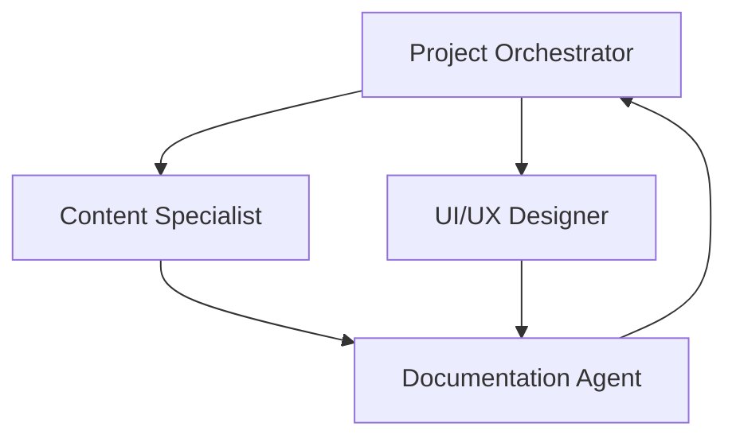
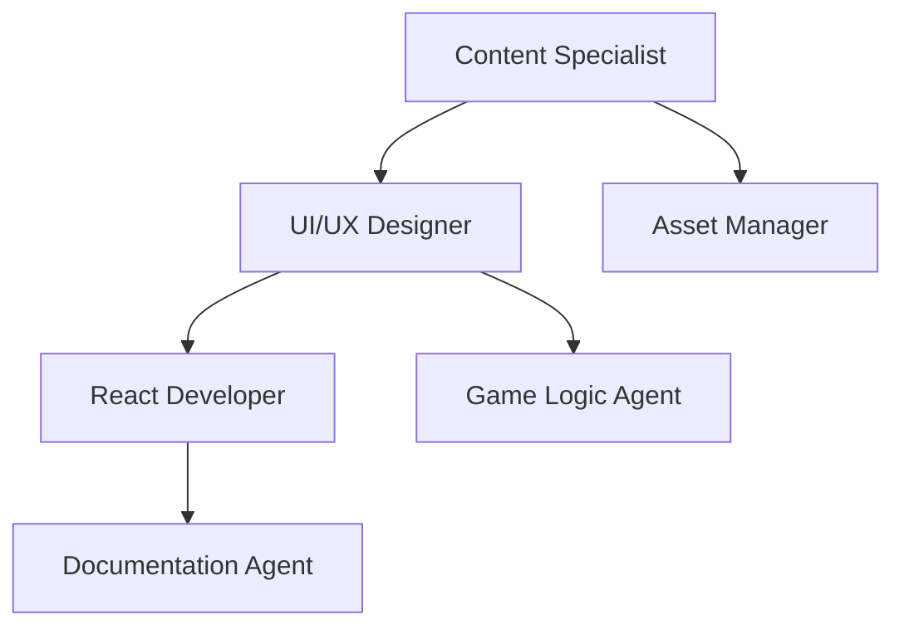
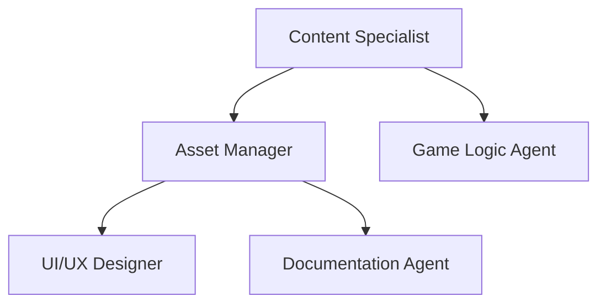
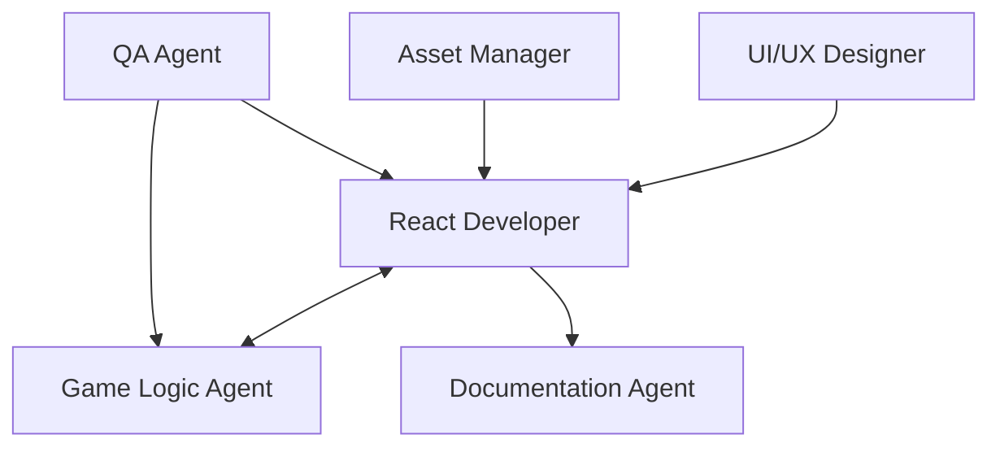
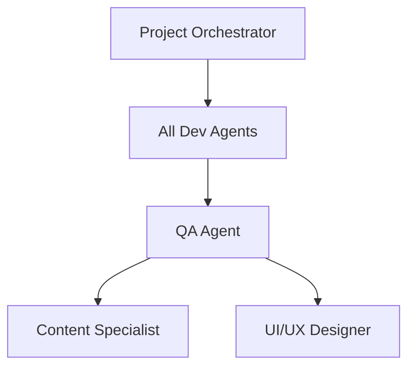
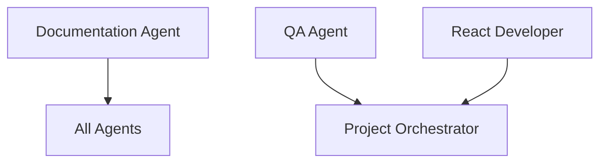

# Agent Interaction Patterns

This document defines how agents collaborate, communicate, and hand off work throughout the development process.

## Core Interaction Principles

### 1. **Structured Handoffs** 📋
Every deliverable transfer between agents follows a standardized format:
- **Context**: What was delivered and why
- **Assumptions**: Key assumptions made during development  
- **Next Steps**: Recommended actions for receiving agent
- **Dependencies**: External requirements or blockers
- **Acceptance Criteria**: How to validate the deliverable

### 2. **Multi-Agent Reviews** 👥
Critical decisions and deliverables require input from multiple agents:
- **Design Reviews**: UI/UX Designer + React Developer + Content Specialist
- **Technical Reviews**: React Developer + Game Logic Agent + QA Agent
- **Content Reviews**: Content Specialist + UI/UX Designer + QA Agent
- **Quality Gates**: QA Agent + Project Orchestrator + relevant specialists

### 3. **Continuous Feedback Loops** 🔄
Agents provide ongoing feedback rather than waiting for phase completions:
- **Daily Standups**: Progress updates and blocker identification
- **Async Reviews**: Continuous review of work-in-progress
- **Early Validation**: Quick validation cycles to prevent rework

---

## Phase-by-Phase Interaction Flows

### Phase 1: Discovery & Planning 🔍

**Key Interactions**:
1. **PO → CS**: Requirements gathering for Irish language content
2. **PO → UX**: User experience and interface requirements  
3. **CS → DOC**: Content requirements and guidelines documentation
4. **UX → DOC**: Design requirements and user personas documentation
5. **DOC → PO**: Consolidated requirements review and approval

**Deliverable Handoffs**:
- Content Specialist → Documentation Agent: Irish language requirements
- UI/UX Designer → Documentation Agent: User experience requirements
- Documentation Agent → Project Orchestrator: Complete requirements document

---

### Phase 2: Design & Architecture 🏗️

**Key Interactions**:
1. **CS → UX**: Vocabulary categories and content structure for design
2. **UX → RD**: Component specifications and design system handoff
3. **UX → GL**: User interaction patterns and game flow requirements
4. **CS → AM**: Image requirements for Irish vocabulary words
5. **RD → DOC**: Technical architecture documentation

**Review Checkpoints**:
- **Design Review**: UX Designer presents to React Developer and Content Specialist
- **Architecture Review**: React Developer presents to Game Logic Agent and QA Agent

---

### Phase 3: Content & Asset Creation 📸

**Key Interactions**:
1. **CS → AM**: Irish vocabulary with specific image requirements
2. **AM → UX**: Asset specifications and visual consistency validation
3. **CS → GL**: Difficulty progression data and content categorization
4. **AM → DOC**: Asset organization and management documentation

**Quality Assurance**:
- Asset Manager validates image quality with UI/UX Designer
- Content Specialist reviews final word-image pairings
- Documentation Agent captures asset management processes

---

### Phase 4: Core Development 💻

**Key Interactions**:
1. **RD ↔ GL**: Bi-directional state management integration
2. **UX → RD**: Component styling and responsive design implementation
3. **AM → RD**: Asset integration and optimization
4. **QA → RD/GL**: Continuous testing feedback and bug reports
5. **RD → DOC**: Code documentation and technical decisions

**Continuous Integration**:
- Daily code reviews between React Developer and Game Logic Agent
- Weekly progress reviews with QA Agent
- Asset integration validation with Asset Manager

---

### Phase 5: Integration & Testing 🧪

**Key Interactions**:
1. **All Dev Agents → QA**: Integration builds and feature completions
2. **QA → CS**: Irish language accuracy validation in context
3. **QA → UX**: Usability testing feedback and accessibility validation
4. **PO → All**: Integration coordination and timeline management

**Testing Workflows**:
- QA Agent conducts cross-browser testing with React Developer support
- Content Specialist validates Irish translations in game context
- UI/UX Designer addresses usability issues identified by QA Agent

---

### Phase 6: Finalization & Documentation 📚

**Key Interactions**:
1. **DOC → All**: Process documentation and lessons learned compilation
2. **QA → PO**: Final quality approval and sign-off
3. **RD → PO**: Deployment readiness and technical handoff

---

## Communication Protocols

### Daily Standups (15 minutes)
**Format**:
- **What I completed yesterday**
- **What I'm working on today**  
- **Blockers or help needed**
- **Handoffs ready or needed**

**Participants**: All agents
**Facilitator**: Project Orchestrator
**Documentation**: Brief notes in decision log

### Weekly Reviews (30 minutes)
**Format**:
- **Progress against phase milestones**
- **Quality metrics and concerns**
- **Upcoming dependencies and handoffs**
- **Process improvements**

**Participants**: All agents
**Facilitator**: Project Orchestrator
**Documentation**: Detailed review notes

### Phase Gate Reviews (60 minutes)
**Format**:
- **Deliverable demonstrations**
- **Acceptance criteria validation**
- **Next phase readiness assessment**
- **Risk and dependency review**

**Participants**: All agents + stakeholders
**Facilitator**: Project Orchestrator
**Documentation**: Formal approval and transition record

---

## Conflict Resolution Patterns

### Technical Disagreements
1. **Agents involved present options** with pros/cons
2. **QA Agent evaluates** quality and risk implications
3. **Project Orchestrator facilitates** decision-making process
4. **Documentation Agent records** decision and rationale

### Timeline Conflicts
1. **Project Orchestrator assesses** impact on overall timeline
2. **Affected agents propose** alternative approaches
3. **Stakeholder consultation** if scope changes required
4. **Revised plan documentation** and communication

### Quality vs. Timeline Trade-offs
1. **QA Agent defines** minimum acceptable quality standards
2. **Project Orchestrator evaluates** business impact
3. **Multi-agent review** of proposed solutions
4. **Documented decision** with success criteria adjustment

---

## Success Metrics for Interactions

### Efficiency Metrics
- **Handoff Time**: < 24 hours between agent handoffs
- **Rework Rate**: < 10% of deliverables require significant rework
- **Review Cycle**: < 48 hours for review and feedback cycles

### Quality Metrics  
- **Acceptance Rate**: > 90% of deliverables accepted on first review
- **Integration Issues**: < 5 integration bugs per phase
- **Documentation Coverage**: 100% of decisions and processes documented

### Communication Metrics
- **Response Time**: < 4 hours for blocker resolution requests
- **Meeting Efficiency**: All meetings finish within planned time
- **Clarity Score**: < 5% of communications require clarification